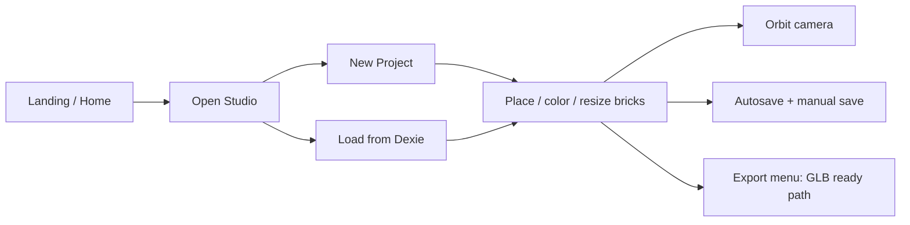

# PRD: Frontfigure — Lego/Bricks Figure Studio

| Field | Value |
|-------|--------|
| **Product** | Frontfigure |
| **Document** | Product Requirements Document (MVP) |
| **Status** | Draft / Approved for implementation |
| **Stack (MVP)** | Next.js 16, Tailwind 4, DaisyUI, Zustand, Dexie, three + R3F + drei |
| **Persistence** | Client-only (IndexedDB via Dexie) — no server DB |
| **UI language** | English (product) |
| **Doc language** | Campuran ID / EN (narasi ID, istilah teknis EN) |

---

## 1. Overview produk

**Frontfigure** adalah web-based figure studio untuk orang kreatif yang suka Lego/bricks. Pengguna membangun figure custom di viewport 3D: pilih brick, atur warna, ukuran, dan slot/koneksi, lalu melihat hasil dengan kamera 3D.

MVP fokus pada **Figure Studio** (builder) — full customize figure dari generic bricks — tanpa backend, auth, atau cloud database.

**Tagline arah:** *Build your own brick figure — full control, game-like studio.*

### 1.1 Konteks repo

Saat dokumen ini ditulis, repo adalah greenfield scaffold Next.js 16 + React 19 + Tailwind 4. Belum ada Three.js, Dexie, Zustand, atau DaisyUI. PRD ini menjadi sumber kebenaran scope MVP sebelum implementasi.

---

## 2. Problem & opportunity

- Pembuat figure custom sering terbentur tool berat (desktop CAD) atau builder yang tidak fleksibel.
- Belum banyak web studio yang terasa seperti **game UI** (cepat, interaktif, rewarding) khusus figure bricks.
- MVP memvalidasi: apakah orang mau custom figure di browser dengan kontrol penuh (warna, ukuran, slot) + output 3D yang siap diekspor.

---

## 3. Goals & non-goals

### 3.1 Goals (MVP)

- Studio desktop-first untuk compose figure dari bricks.
- Custom penuh: warna, ukuran brick, sistem slot/stud.
- Viewport 3D interaktif (orbit / pan / zoom).
- Persist lokal (Dexie) — project bisa disimpan dan dibuka ulang di browser yang sama.
- Fondasi scene graph serializable + jalur export **GLB** (ship di akhir MVP atau segera setelah builder stabil).
- UI simple, interactive, gamified, non-generic “AI slop” — termasuk custom Alert / Confirm.

### 3.2 Non-goals (MVP)

- Auth, multi-user, cloud sync, database server.
- Mobile-first / touch-first (responsive cukup usable, bukan prioritas).
- Katalog resmi Lego / trademark assets — gunakan **generic bricks** (inspired-by, bukan brand-official).
- Physics simulation, minifig rig resmi, marketplace, print-ready BOM.
- Export **FBX** di MVP (hanya dipersiapkan di arsitektur; ship post-MVP).

---

## 4. Target pengguna

| Persona | Butuh | Pain |
|---------|--------|------|
| Creative brick hobbyist | Figure unik untuk display / foto / konten | Tool terlalu berat atau terlalu kaku |
| Digital maker / 3D curious | Eksperimen bentuk cepat di browser | Tidak mau install Blender dulu |
| Casual builder | UI seperti game, feedback jelas | UI CAD intimidatif |

**Primary:** creative brick hobbyist yang ingin figure custom 3D tanpa tool desktop berat.

---

## 5. User journeys (MVP)



1. Buka app → landing singkat → CTA **Enter Studio**, atau langsung ke `/studio`.
2. Buat project baru atau load project tersimpan (Dexie).
3. Pilih brick dari palette → place di grid/slot → recolor / resize → hapus / undo.
4. Orbit kamera untuk review figure.
5. Autosave / manual save; export GLB bila siap (atau menu export dengan pipeline scene sudah export-ready).

---

## 6. Functional requirements

### 6.1 Figure Studio (core)

| ID | Requirement |
|----|-------------|
| FS-01 | Viewport 3D full-bleed di area kerja utama studio |
| FS-02 | Brick palette dari katalog MVP (§8) |
| FS-03 | Place brick pada stud grid; snap ke slot valid |
| FS-04 | Select brick → inspector: warna, ukuran (dalam katalog), hapus |
| FS-05 | Transform MVP: position via snap; rotasi Y dalam langkah 90° |
| FS-06 | Undo / redo (history stack di Zustand) |
| FS-07 | Grid / ground plane + stud hints saat place mode (hover ghost) |

### 6.2 Customization

| ID | Requirement |
|----|-------------|
| CU-01 | Warna: preset palette + custom hex (material simple / PBR ringan) |
| CU-02 | Ukuran: variasi dimensi dari katalog (brick & plate sizes) |
| CU-03 | Slot: setiap brick punya stud atas + anti-stud bawah; placement prefer koneksi valid; fallback MVP: free-place di ground dengan snap grid |

### 6.3 Camera

| ID | Requirement |
|----|-------------|
| CA-01 | OrbitControls: rotate, pan, zoom |
| CA-02 | Reset camera ke default framing |
| CA-03 | (Nice-to-have) Frame selection ringan |

### 6.4 Persistence (Dexie)

| ID | Requirement |
|----|-------------|
| PE-01 | Store `projects`: id, name, createdAt, updatedAt, scene |
| PE-02 | Autosave dengan debounce |
| PE-03 | Manual save |
| PE-04 | List / rename / delete project di UI ringan (modal atau drawer) |
| PE-05 | Tidak ada sync antar device / browser |

### 6.5 Export

| ID | Requirement |
|----|-------------|
| EX-01 | Scene data model serializable (bukan hanya mesh ad-hoc) |
| EX-02 | MVP target: export **GLB** dari scene Three.js (download file) |
| EX-03 | Post-MVP: export **FBX** |
| EX-04 | Jika GLB belum ship di M4: menu Export menampilkan status jelas + scene tetap export-ready |

### 6.6 UX / UI chrome

| ID | Requirement |
|----|-------------|
| UI-01 | Layout studio seperti game HUD: top bar, left palette, right inspector, optional bottom tool strip |
| UI-02 | Custom `Alert` dan `Confirm` — tidak memakai `window.alert` / `window.confirm` |
| UI-03 | DaisyUI untuk primitive (btn, modal shell, inputs) + skin custom (bukan default Daisy mentah) |
| UI-04 | Desktop-first (~1280px+ sebagai target utama) |

---

## 7. Acceptance criteria (MVP)

Kriteria di bawah harus terpenuhi agar fitur dianggap done.

### 7.1 Figure Studio

- [ ] User dapat membuka `/studio` dan melihat viewport 3D aktif tanpa error konsol blocking.
- [ ] Palette menampilkan seluruh part katalog MVP; memilih part mengaktifkan place mode.
- [ ] Ghost brick mengikuti hover dan snap ke grid stud; klik menempatkan brick pada posisi grid yang valid.
- [ ] Klik brick yang sudah ditempatkan menyeleksinya (highlight visual jelas).
- [ ] Delete (toolbar atau keyboard) menghapus selection; Undo mengembalikan state sebelumnya; Redo memajukan lagi.
- [ ] Rotasi Y selection hanya pada langkah 0 / 90 / 180 / 270.
- [ ] Soft-limit brick count (mis. 500): saat mendekati/melewati limit, muncul warning via custom Alert — tidak crash.

### 7.2 Customization

- [ ] Inspector menampilkan warna brick terpilih; mengubah preset atau hex memperbarui material di viewport segera.
- [ ] Mengganti ukuran/part (dalam katalog yang kompatibel) memperbarui footprint/height di scene dan tetap di grid.
- [ ] Placement di atas brick lain menghormati stud/anti-stud bila target slot valid; di ground, snap grid tetap bekerja sebagai fallback.

### 7.3 Camera

- [ ] Drag orbit merotasi kamera; pan dan zoom berfungsi tanpa “melempar” scene ke posisi rusak.
- [ ] Reset camera mengembalikan posisi/target default yang usable untuk melihat figure.
- [ ] Interaksi kamera tidak menempatkan brick secara tidak sengaja (place vs orbit terpisah dengan jelas).

### 7.4 Persistence (Dexie)

- [ ] New project membuat record Dexie; autosave menulis perubahan scene setelah idle debounce.
- [ ] Refresh halaman lalu load project yang sama → scene visual-identik (bricks, warna, posisi, rotasi).
- [ ] Rename dan delete project bekerja; delete memakai custom Confirm sebelum menghapus.
- [ ] Manual Save memperbarui `updatedAt` dan bisa diverifikasi dari project list.

### 7.5 Export (prep / GLB)

- [ ] `Scene` / `PlacedBrick` tersimpan sebagai data serializable yang cukup untuk rebuild mesh.
- [ ] Menu Export tersedia di studio chrome.
- [ ] **Done-when-shipped:** Export GLB menghasilkan file yang terbuka di viewer GLB umum (mis. Windows 3D Viewer / online GLTF viewer) dengan geometri dan warna yang masuk akal.
- [ ] **Done-when-prep-only:** Jika GLB belum diimplementasi, Export menampilkan messaging jelas (bukan silent no-op) dan tidak mengklaim file sudah terunduh.

### 7.6 UI / gamification / dialogs

- [ ] Landing `/` menampilkan brand **Frontfigure** sebagai sinyal hero-level, satu headline, satu CTA utama ke studio, visual dominant — bukan dashboard/stats clutter.
- [ ] Studio terasa HUD/game-like: palette, inspector, dan feedback placement (ghost + snap) terbaca dalam satu composition.
- [ ] Tidak ada `window.alert` / `window.confirm` untuk alur produk; Alert/Confirm custom dipakai untuk error, warning soft-limit, dan destruktif (delete project).
- [ ] Minimal 2–3 motion intentional: mis. palette hover, place confirm feedback, save pulse/indicator.
- [ ] Desktop layout (~1280px+) usable tanpa overlap kritis antara palette, viewport, dan inspector.

---

## 8. Brick catalog (MVP)

Generic bricks saja (bukan aset bermerek):

| Category | Sizes |
|----------|--------|
| Brick | 1×1, 1×2, 2×2, 2×4 |
| Plate | 1×1, 1×2, 2×2, 2×4 |
| Optional MVP+ | 1×1 round, slope sederhana (jika waktu cukup) |

Setiap part mendefinisikan minimal:

- `id`
- `footprint` (stud units)
- `height` (plate/brick units)
- `studMap` / anti-stud
- `colorDefault`
- geometry (parametric mesh atau asset generik)

**Copy & legal:** gunakan istilah “bricks” / “studs” secara generik; hindari klaim afiliasi merek.

---

## 9. Tech stack (locked)

| Layer | Choice |
|-------|--------|
| Framework | Next.js 16 (App Router) — sudah ada di repo |
| UI | Tailwind CSS 4 + DaisyUI + custom chrome / tokens |
| State | Zustand (editor + UI) |
| Persist | Dexie (IndexedDB) |
| 3D | `three` + `@react-three/fiber` + `@react-three/drei` |
| Dialogs | Custom Alert / Confirm components |
| Server DB | Tidak untuk MVP |

**Catatan implementasi:** ikuti panduan Next di `node_modules/next/dist/docs/` (lihat `AGENTS.md`). Verifikasi kompatibilitas DaisyUI dengan Tailwind 4 pada milestone foundation.

---

## 10. Information architecture

| Route | Purpose |
|-------|---------|
| `/` | Landing singkat: brand + headline + CTA Enter Studio + visual |
| `/studio` | Figure Studio (inti MVP) |

Project list / switcher: modal atau drawer di dalam studio (bukan route wajib di MVP).

---

## 11. Data model

Conceptual model (detail implementasi boleh menyimpang selama field semantik sama):

```ts
type Project = {
  id: string
  name: string
  createdAt: number
  updatedAt: number
  scene: Scene
}

type Scene = {
  bricks: PlacedBrick[]
  camera?: CameraState
}

type PlacedBrick = {
  instanceId: string
  partId: string
  color: string // hex
  position: { x: number; y: number; z: number } // stud grid units
  rotationY: 0 | 90 | 180 | 270
}

type CameraState = {
  position: [number, number, number]
  target: [number, number, number]
}
```

**Zustand (runtime):** selection, tool mode (`select` | `place` | …), history (undo/redo), UI flags; clipboard opsional.

**Dexie:** persist snapshot `Project` (termasuk `scene`).

---

## 12. UI / design direction

- Arah visual: **game-like figure workshop** — HUD jelas, feedback placement (ghost brick, snap flash), bukan dashboard SaaS.
- Hindari klise desain generik: purple-on-white / purple–indigo gradient default, cream + serif + terracotta, broadsheet dense newspaper UI.
- Tipografi ekspresif (hindari Inter / Roboto / Arial / system sebagai display utama).
- Definisikan CSS variables untuk palette studio (background atmosphere, accent, HUD surfaces).
- Motion: 2–3 intentional (bukan noise) — palette hover, place confirm, save feedback.
- Landing hero: brand kuat + satu headline + satu supporting line singkat + satu CTA group + satu visual dominant full-bleed; tanpa stats / cards promo di first viewport.
- Studio: cards hanya jika diperlukan untuk interaksi (palette item, modal); viewport bukan “card” inset kecil.

---

## 13. Success metrics (kualitatif MVP)

- User dapat membangun figure ≥10 bricks dalam satu sesi; refresh tidak menghilangkan data (autosave).
- Place + recolor + resize terasa snappy di desktop modern.
- Reload dari Dexie menghasilkan scene visual-identik.
- GLB export (bila di-ship) terbuka di viewer umum dengan geometri/warna yang masuk akal.

---

## 14. Milestones

| Milestone | Deliverable |
|-----------|-------------|
| **M0 — Foundation** | Install R3F / drei / three, Dexie, Zustand, DaisyUI; theme tokens; Alert/Confirm; routes `/` + `/studio` |
| **M1 — Viewport + catalog** | Render bricks parametric/mesh; orbit camera; palette |
| **M2 — Builder** | Place / snap / select / delete / recolor / resize; undo / redo |
| **M3 — Persist** | Dexie projects; autosave; project switcher (list/rename/delete) |
| **M4 — Polish + export** | HUD gamification; landing brand; GLB export **atau** export menu + scene export-ready terkunci |
| **Post-MVP** | FBX; more parts; mobile polish; cloud sync (opsional) |

---

## 15. Risks & mitigations

| Risk | Mitigation |
|------|------------|
| Perf dengan banyak mesh | Instancing / merge strategy; soft-limit + warning |
| Connection / stud logic rumit | MVP: grid snap + stud check sederhana; ground fallback |
| Trademark / branding | Generic “bricks”; copy netral; no official logos |
| DaisyUI vs Tailwind 4 | Verifikasi di M0; fallback skin Tailwind murni bila blocker |
| Scope creep export / FBX | GLB dulu; FBX eksplisit post-MVP |

---

## 16. Decisions & assumptions

Keputusan yang dikunci untuk MVP:

| Topic | Decision |
|-------|----------|
| Nama produk | **Frontfigure** |
| Bahasa UI | English |
| Parts | Generic bricks — bukan Lego-branded |
| DB | Tidak ada server DB; Dexie saja |
| Export MVP | GLB (ship atau prepare keras di M4); FBX di luar MVP |
| Platform fokus | Desktop-first |
| 3D approach | React Three Fiber di atas Three.js |

---

## 17. Out of scope checklist (pengingat)

- Login / accounts  
- Shared links / multiplayer  
- Official Lego part numbers / logos  
- Physics / destruction  
- Mobile app  
- Server-side rendering of 3D scene sebagai substitusi client studio  
- FBX export  

---

## 18. Referensi implementasi (repo)

| Path | Catatan |
|------|---------|
| `app/` | App Router — landing + studio |
| `docs/PRD.md` | Dokumen ini |
| `AGENTS.md` | Aturan agent Next.js — baca docs lokal sebelum coding |
| `package.json` | Dependencies MVP ditambahkan mulai M0 |

---

*End of PRD — Frontfigure MVP.*
